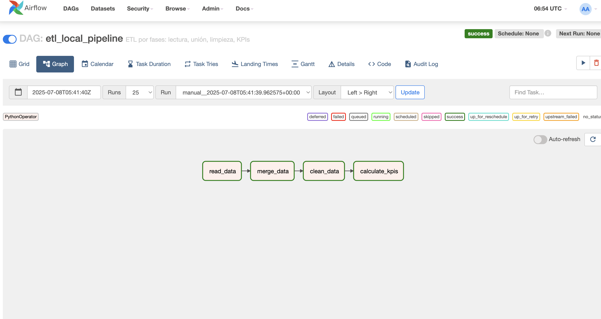

# MIGx Data Engineer Technical Challenge
Congratulations, you’ve made it to the technical test! Completing this will help us assess your technical and problem-solving skills.

## Description
This exercise consists of two distinct parts. 

The first one is a programming problem, where you are expected to set up a small project from scratch in order to solve the use case problem explained below, using either Scala or Python as your programming language of choice. How you set up the project and its structure is up to you, and you can use any data processing library you see fit (or no dependencies at all!). In any case, you’ll have to provide instructions on how to run this project locally.

The second part are open-ended questions on different aspects of architecture and high-level decisions you may have to take on hypothetical scenarios. You can write down the answers to them in any popular file format (like Word, Markdown, Asciidoc, etc.) and optionally export it to a PDF. Just make sure you give us the raw file.

Keep in mind that you’re not expected to complete the totality of this assignment. If you don’t complete some bullet points that’s OK, it will help us guide the follow-up interview where we’ll ask you about what you’ve given to us and why you did (or didn’t) take those decisions.

## Final result
You are expected to commit all the components from your solution to a git repository and share it with **MIGx-user** so we can review your challenge.
---


# MIGx Data Engineering Challenge

Este repositorio contiene la solución técnica al desafío de ingeniería de datos de MIGx. Se utilizó **Airflow** como orquestador de un pipeline ETL para procesar y analizar datos clínicos.

---
#  Instrucciones para ejecutar localmente

### 1. Requisitos

- Docker
- Docker Compose
- Git

### 2. Clonar el repositorio

```bash
git clone git@github.com:helenagomez/data-engineering-challenge.git
cd data-engineering-challenge
---
# Iniciar Airflow con Docker Compose

```bash
docker compose up -d --build
```
Esto levantará:

* PostgreSQL
* Redis
* Airflow Webserver, Scheduler, Worker
* Airflow Triggerer

Airflow estará disponible en http://localhost:8080

* Usuario: airflow
* Contraseña: airflow

# Copiar los archivos de datos
Coloca los CSV entregados en la carpeta data/:

* data/Patients.csv
* data/Clinical_Trial.csv
* data/Patients_Trials.csv

# ¿Qué hace el DAG?
El DAG ejecuta una pipeline con las siguientes tareas:

* Lectura de datos: desde archivos CSV
* Unión de tablas: relaciones pacientes ↔ ensayos ↔ medicamentos
* Limpieza de datos: eliminación de nulos, duplicados
* Cálculo de KPIs: como pacientes por país, medicamentos más usados, duración promedio de ensayos, etc.




# El resultado se guarda en output/kpis.csv

KPIs Calculados:

* Número de pacientes por país
* Edad promedio por diagnóstico
* Medicamentos más utilizados
* Duración promedio de ensayos
* Tiempo entre ensayos del mismo paciente
* Porcentaje de datos faltantes
* Porcentaje de pacientes en múltiples ensayos

# Autor
Helena Gómez
github.com/helenagomez
